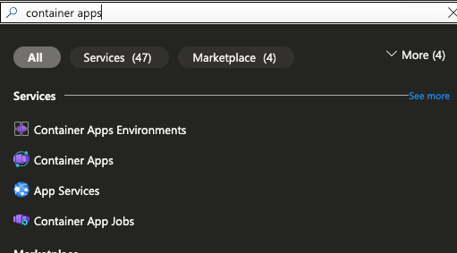
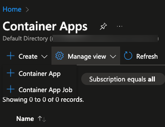
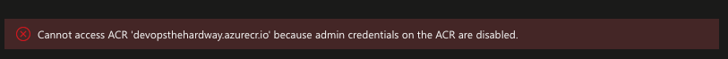
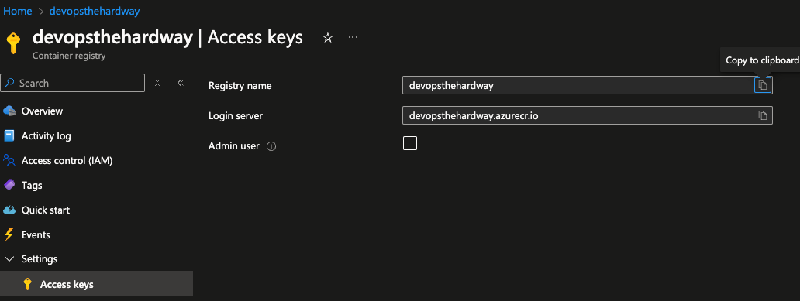
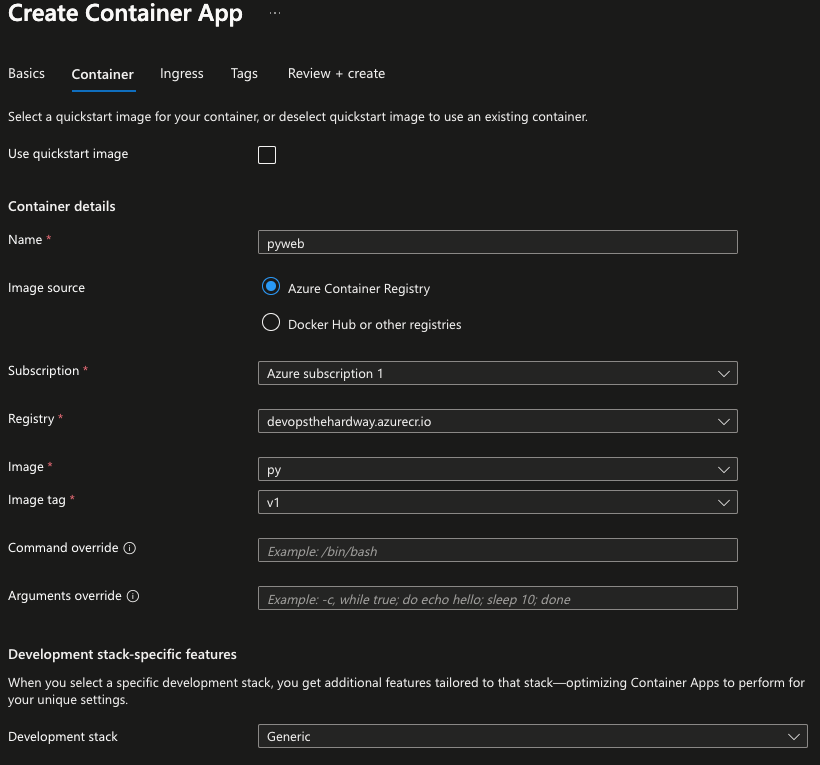
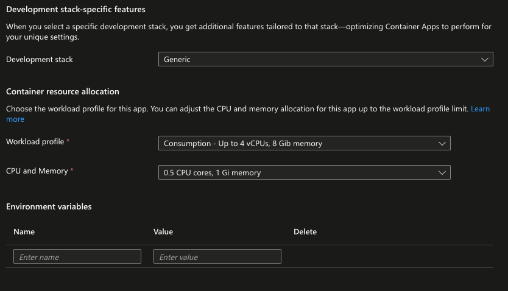
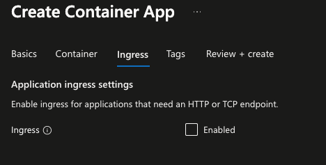
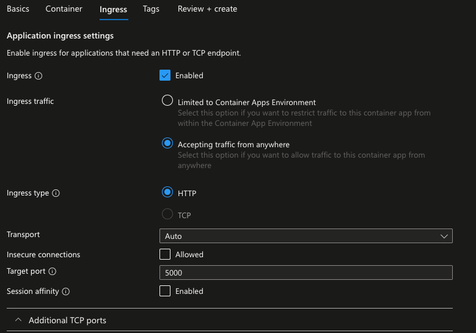
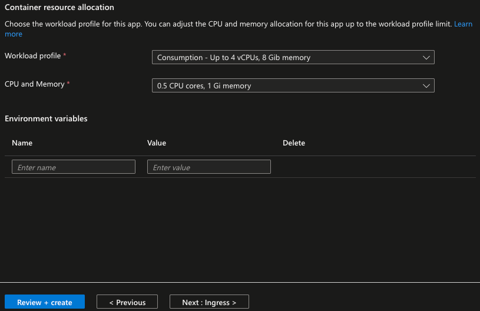

1. First, look up "container apps" in the Azure porta.

2. Click the blue **+ Create > Container App** button

3. Fill in the information for your resource group, subscription, region, and container app name.

There's a toggle to choose between choosing code or choosing a container image. Choose the Container Image option.

4. You may see this message in the **Container Tab**. If you do, take a look at step 5. If you don't, skip step 5.

5. Within the ACR portal under youe registry, go to **Settings > Access Keys** and click the **Admin user** button.

6. You'll see a toggle to choose a container image from ACR. Choose your registry along with the container image and tag.

7. Under **Container resource allocation**, you can leave these default. It's all going to depend on the app you're deploying
and the Python web app is pretty small, so these defaults are fine.

8. Under the **Ingress** tab is where you can specify whether or not you want an endpoint/URL for your app. Because it's
a web app, it makes sense to toggle this feature.

9. There will be a few options including whether or not you want anyone to be able to reach the app and the target
port which is `5000`. You can toggle the **Accepting traffic from anywhere** as this is a public app.

10. Once complete, click the blue ** Review + create** button.

