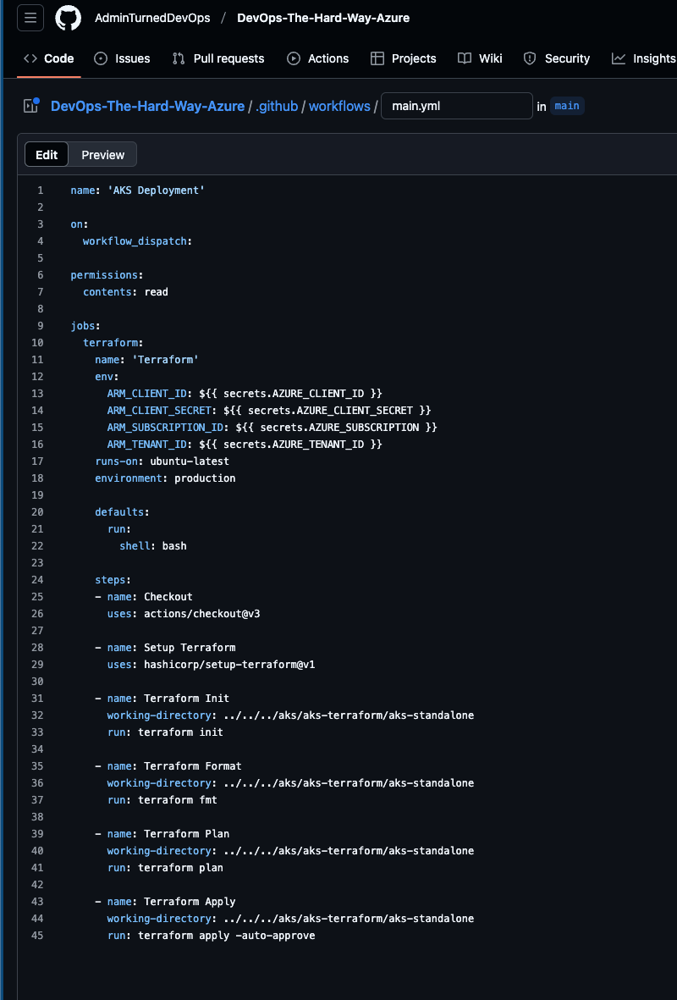
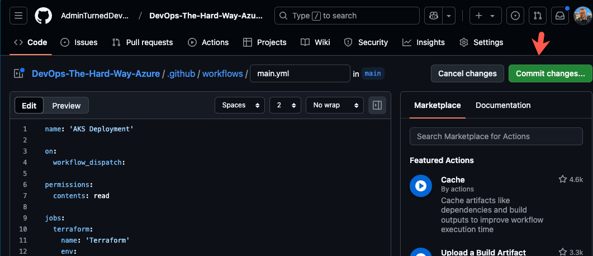
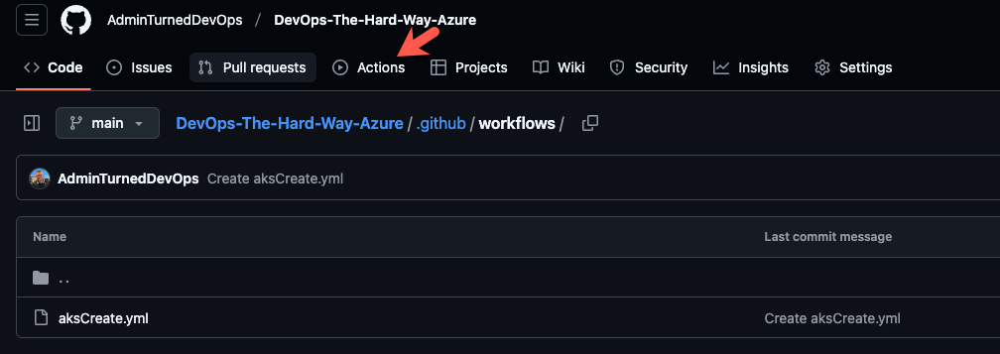
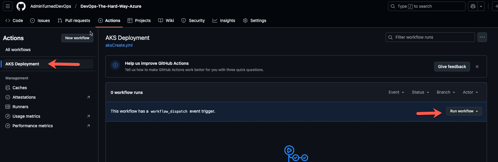
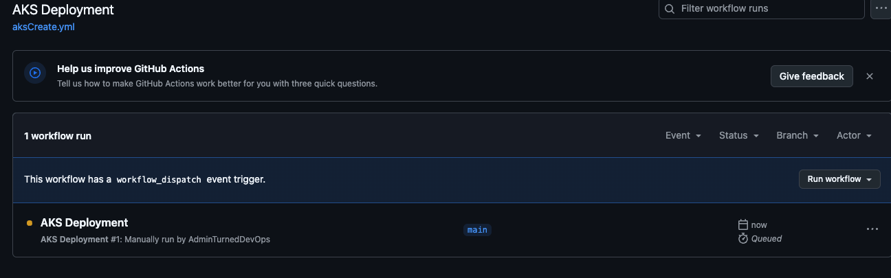

1. Log into GitHub Actions and go to a repo where you want to run this pipeline. For example, if I'm running this pipeline in the **DevOps-The-Hard-Way-Azure** repo, it would look like the below:


2. Click on the blue **set up a workflow yourself** button


3. Add in the following pipeline:
```
name: 'AKS Deployment'

on:
  workflow_dispatch:

permissions:
  contents: read

jobs:
  terraform:
    name: 'Terraform'
    env:
      ARM_CLIENT_ID: ${{ secrets.AZURE_CLIENT_ID }}
      ARM_CLIENT_SECRET: ${{ secrets.AZURE_CLIENT_SECRET }}
      ARM_SUBSCRIPTION_ID: ${{ secrets.AZURE_SUBSCRIPTION }}
      ARM_TENANT_ID: ${{ secrets.AZURE_TENANT_ID }}
    runs-on: ubuntu-latest
    environment: production

    defaults:
      run:
        shell: bash

    steps:
    - name: Checkout
      uses: actions/checkout@v3

    - name: Setup Terraform
      uses: hashicorp/setup-terraform@v1

    - name: Terraform Init
      working-directory: ../../../aks/aks-terraform/aks-standalone
      run: terraform init
           
    - name: Terraform Format
      working-directory: ../../../aks/aks-terraform/aks-standalone
      run: terraform fmt

    - name: Terraform Plan
      working-directory: ../../../aks/aks-terraform/aks-standalone
      run: terraform plan
    
    - name: Terraform Apply
      working-directory: ../../../aks/aks-terraform/aks-standalone
      run: terraform apply -auto-approve
```

It should look like the below:


4. Let's break down the pipeline:

First, you can see under `env` that the secrets are being called upon.

Next, you can see that the Terraform commands like `init`, `apply`, and `plan`. Notice that it specifies a `working-directory`. This is where the Terraform code via **DevOps-The-Hard-Way-Azure** is. If you put the Terraform configs in another directory, you'll want to change the path.

The rest of the pipeline is standard CICD configurations like the name, permissions, and how it's running.

5. Once ready, click the green **Commit changes...** button.


6. You'll now see the saved pipeline. Click the **Actions** button.


7. Under **Actions**, you'll see the workflow you created. You can click the **Run workflow** button to kick off the pipeline.


8. You'll now see the pipeline queued up.

