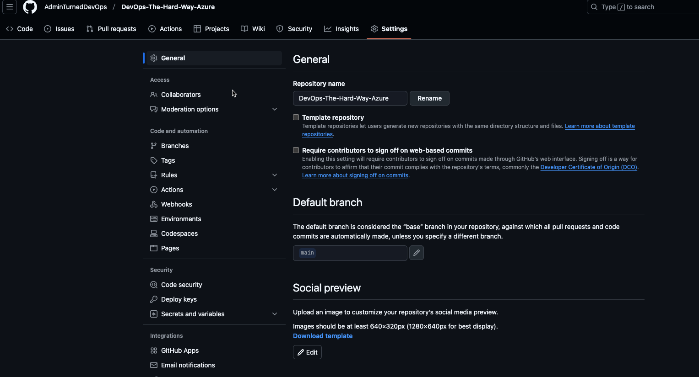
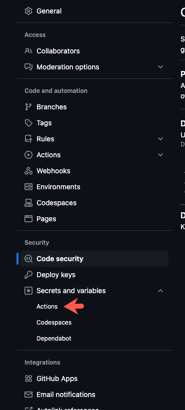
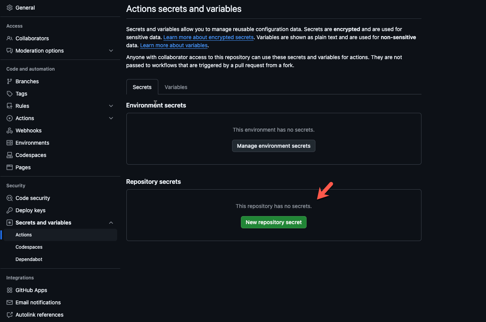
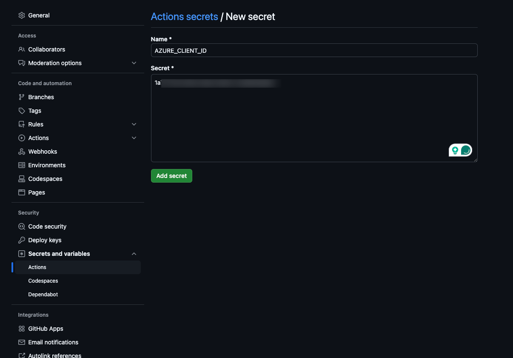
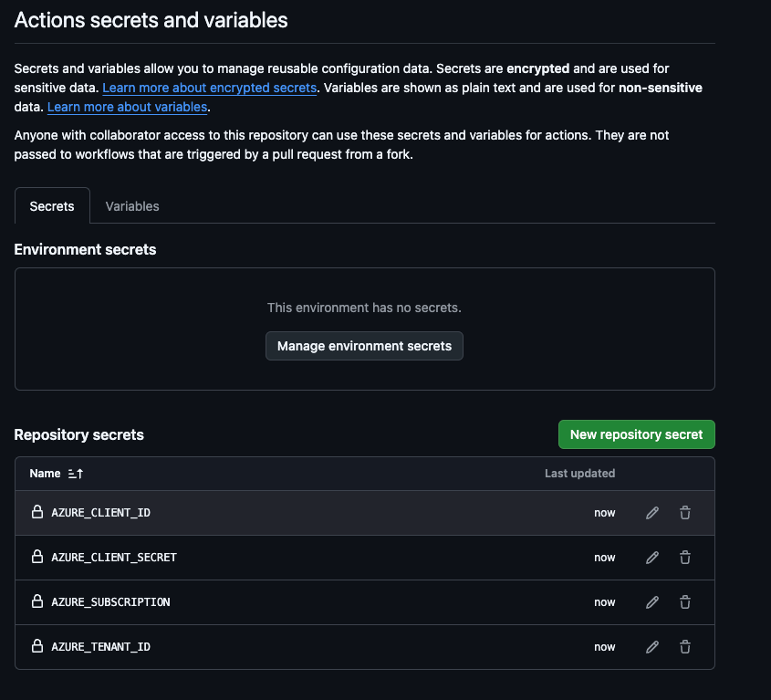

In the previous sections labs, you learned how to deploy an AKS cluster via the terminal.

Let's now focus on how to automate this process with CICD.

There are two primary steps you'll need:
1. Authentication and authorization to the CICD platform.
2. Create the CICD pipeline.

For the purposes of these labs, you'll learn how to configure a pipeline in GitHub Actions. Although there are some amazing CICD tools, GitHub Actions seemed to make the most sense as the majority of people have a GitHub Account.

## Secret Creation

For GitHub Actions to authenticate (log in) and authorize (what permissions are available) to Azure for the creation of the AKS cluster, you'll need:
- A client ID (addID)
- A tenant ID
- A password

1. To create one for Azure, you can use the `create-for-rbac` subcommand under the `ad sp` command.

```
az ad sp create-for-rbac -n MyApp \
--role Contributor \
--scopes /subscriptions/00000000-0000-0000-0000-000000000000/resourceGroups/resourceGroup1
```

For example, if my resource group name was **devrelasaservice** and I wanted the name to be **git**, it would look like the following:
```
az ad sp create-for-rbac -n git \
--role Contributor \
--scopes /subscriptions/SUB_ID_HERE/resourceGroups/devrelasaservice
```

2. You'll see an output similiar to the below:
```
{
  "appId": "GUID-HERE",
  "displayName": "git",
  "password": "PASSWORD-HERE",
  "tenant": "TENANT-ID-HERE"
}
```

3. Log into GitHub and go to a repo where you want to run this pipeline.

For example, if I'm running this pipeline in the **DevOps-The-Hard-Way-Azure** repo, I would click on the repo and then go to *Settings**



4. Next, under **Security**, go to **Secrets and variables > Actions**



5. Click the green **New repository secret** button



6. You'll need to add four secrets. Each secret will have one of the values that were output via the `ad sp create-for-rbac` command.

The reason why you need to name them a certain way is because the secret variables will be called upon via the CICD pipeline.

Create 4 with the following names:
- AZURE_CLIENT_ID
- AZURE_CLIENT_SECRET
- AZURE_SUBSCRIPTION
- AZURE_TENANT_ID

`AZURE_CLIENT_ID` == the appId
`AZURE_CLIENT_SECRET` == the password
`AZURE_SUBSCRIPTION` == your Azure subscription ID
`AZURE_TENANT_ID` == the tenand ID

For example, here is one secret with the azure client ID/app id



This is what all for should look like:



7. You're now prepared to go on to the next lab to create the pipeline.