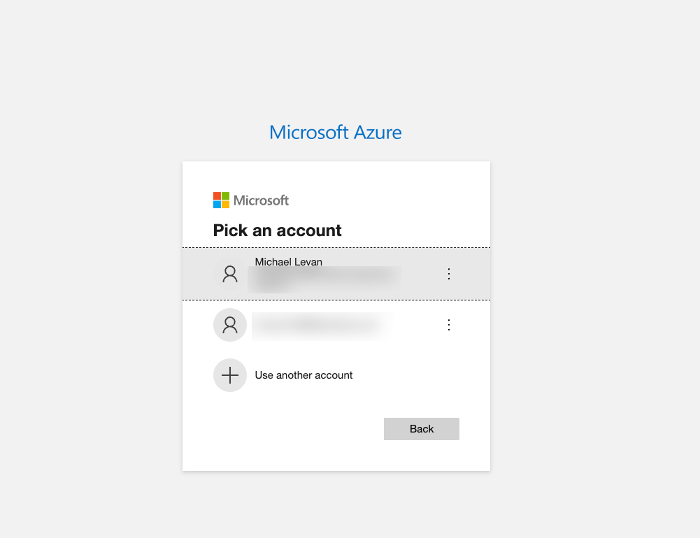
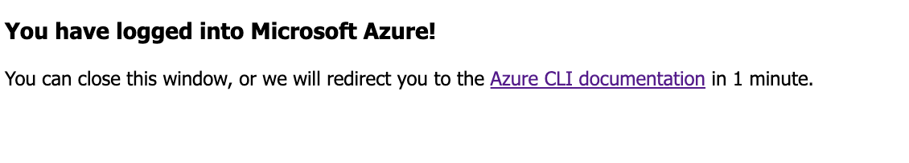

To interact with Azure locally from a programmatic perspective, you have two usual choices:

1. Log into the AZ CLI locally.
2. Use an App Registration to specify a tenant ID, client ID, secret, and app ID to log in.

From a production perspective, you're going to use the second option and you'll see how to do this in the *CICD** section.

For the purposes of this specific lab, let's go with number 1.

1. First, ensure that you went through the prerequisite section which is number 1 in the lab section.2
2. Next, run the following command to ensure that the CLI works.
```
az
```

You should see an output like the below.
```
     /\
    /  \    _____   _ _  ___ _
   / /\ \  |_  / | | | \'__/ _\
  / ____ \  / /| |_| | | |  __/
 /_/    \_\/___|\__,_|_|  \___|


Welcome to the cool new Azure CLI!

Use `az --version` to display the current version.
Here are the base commands:

    account             : Manage Azure subscription information.
    acr                 : Manage private registries with Azure Container Registries.
    ad                  : Manage Microsoft Entra ID (formerly known as Azure Active Directory, Azure
                         AD, AAD) entities needed for Azure role-based access control (Azure RBAC)
                         through Microsoft Graph API.
    advisor             : Manage Azure Advisor.
    afd                 : Manage Azure Front Door Standard/Premium.
    aks                 : Manage Azure Kubernetes Services.
    ams                 : Manage Azure Media Services resources.
    apim                : Manage Azure API Management services.
    appconfig           : Manage App Configurations.
```

3. Now that you know the Azure CLI works, run the following command to log into the CLI.

```
az login
```

You'll see a prompt that asks you to sign in via the email address that you used to create the Azure account.


You'll then see another screen that shows a successful login.


4. Test to confirm that your account shows up.
```
az account show
```

You should see a JSON output with your account info.