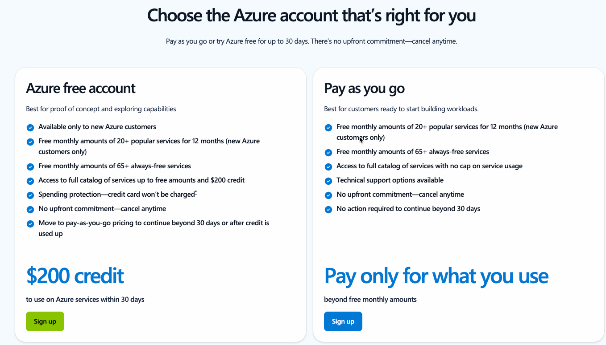

Luckily, creating an account is pretty easy.

First, go [here](https://go.microsoft.com/fwlink/?linkid=2227353&clcid=0x409&l=en-us) to try Azure for free

Next, you'll have to type in some info like name, email address, etc...

After that, you should have an Azure subscription up and running.

With the free Azure account, you also get $200.00 in credits for up to 30 days.

After the 30 days, you can put your credit card in and pay-as-you-go.

