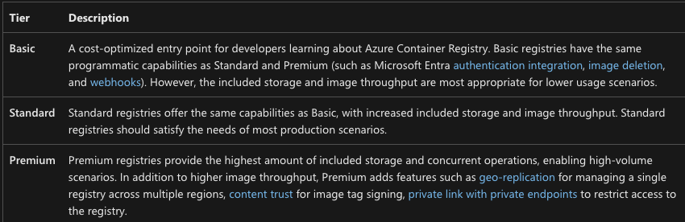

1. Create an Azure Container Registry (ACR) specifying:
- The resource group that you want the ACR to exist in.
- The name of the ACR

For the purposes of the SKU, you can leave it as `Basic`.

If you're wondering, here are the differences in the SKU per the Microsoft docs.



```
az acr create --resource-group myResourceGroup --name mycontainerregistry --sku Basic
```

If you'd like to do the same with Terraform, here's the resource block:

```
resource "azurerm_container_registry" "devopsthehardway" {
  name                = "devopsthehardwayregistry"
  resource_group_name = var.rgName
  location            = var.location
  sku                 = "Standard"
}
```