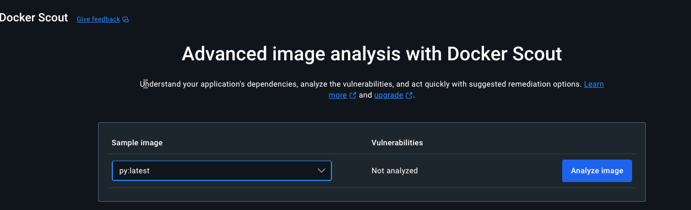
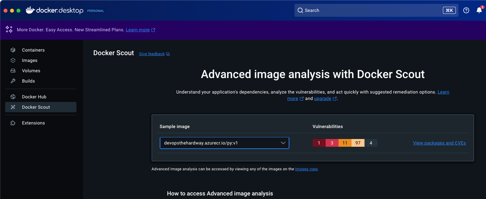
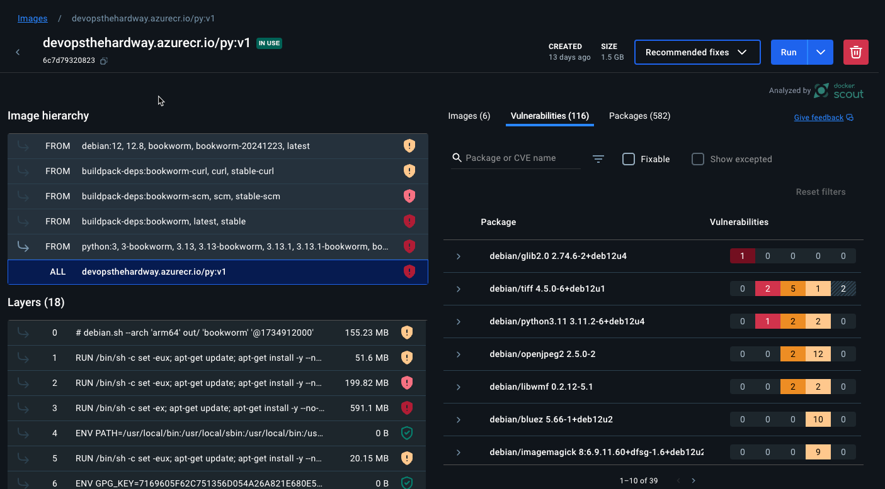

There are a few steps that you should think about when securing an application stack that's going to be containerized. The majority of those steps are way before the containerization process even occurs.

There are tests like:
1. Security linting
2. SAST
3. DAST

And various tools like Sonarqube and Checkov to help.

When the security scanning of the code itself is complete and the application is containerized, you can then begin to think about how to scan the container image itself. There are several tools available for this, but one that feels "out of the box" considering the majority of engineers have Docker Desktop running is `docker scout`.

Docker Scout is built into the Docker Engine and scans container images for security vulnerabilities.

You can use Docker Scout with:
1. The Docker Desktop GUI
2. The CLI

1. To use it with the GUI, you'll see a **Scout** button in the GUI.

2. You can then choose which image you'd like to scan.



3. Scout works with images that aren't on your local machine as well, so you can, for example, scan the container image that's in your Azure Container Registry. 



4. Once scanned, you'll see what vulnerabilities exist and you can run a fix for them as well right from Docker Desktop. 



5. Before running the automated fixes, let's do the same in the CLI. That way, we know how to automate the process later if we would like to. The command you'll most likely use is `quickview.

For example, I can run the `quickview` command against the container image in my ACR.

```
docker scout quickview devopsthehardway.azurecr.io/py:v1
```

Once complete, you'll see an output similiar to the below.

```
    i New version 1.16.1 available (installed version is 1.15.1) at https://github.com/docker/scout-cli
          ✓ SBOM of image already cached, 582 packages indexed
    ✓ Provenance obtained from attestation

    i Base image was auto-detected. To get more accurate results, build images with max-mode provenance attestations.
      Review docs.docker.com ↗ for more information.
      
  Target               │  devopsthehardway.azurecr.io/py:v1  │    1C     3H    11M    97L     4?   
    digest             │  6c7d79320823                       │                                     
  Base image           │  python:3                           │    1C     3H    11M    97L     4?   
  Refreshed base image │  python:3                           │    0C     0H     4M   119L     4?   
                       │                                     │    -1     -3     -7    +22          
  Updated base image   │  python:alpine                      │    0C     0H     0M     0L          
                       │                                     │    -1     -3    -11    -97     -4   

What's next:
    View vulnerabilities → docker scout cves devopsthehardway.azurecr.io/py:v1
    View base image update recommendations → docker scout recommendations devopsthehardway.azurecr.io/py:v1
    Include policy results in your quickview by supplying an organization → docker scout quickview devopsthehardway.azurecr.io/py:v1 --org <organization>
```

You now have a good understanding of where the vulnerabilities exist within your container image.